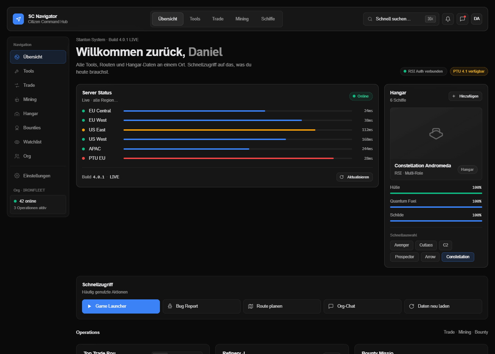

# SC Navigator

Ein modernes, minimales Dashboard für **Star Citizen** Tools, Trade-Routen, Mining-Refinery-Timer, Bounty-Tracker und Hangar-Übersicht. Glassmorphism + Tailwind, läuft als reine HTML/JS-Anwendung — kein Build, kein Server, keine Abhängigkeiten zum Installieren.



## Features

- **Tool-Verzeichnis** — 17 Community-Tools (Erkul, UEXcorp, SC Trade Tools, Regolith, StarMap, Spectrum, Pledge Store, Star Hangar, Wiki, …) mit Suche, Kategorie-Filter, Sortierung und Favoriten (in `localStorage`)
- **Server Status** — Ping/Last für EU/US/APAC inkl. PTU
- **Hangar-Übersicht** — Schiffsauswahl mit Hülle/Fuel/Schilden
- **Trade Routes** — Top-Profit-Routen, sortierbar nach Profit/Risiko/Name
- **Refinery Jobs** — Live-Countdown für laufende Mining-Refining-Aufträge
- **Bounty Tracker** — Missionen annehmen/ablehnen, Reward-Summe
- **Watchlist** — Schiffspreise (Pledge / Star Hangar) mit Alerts
- **Events & Patch** — Aktive Events (XenoThreat, Jumptown, …) + Patch Highlights
- **Tweaks-Panel** — Glass-Blur, Hintergrundbild, Light/Dark live anpassbar
- **Voll auf Deutsch**

## Tech-Stack

- React 18 (UMD, kein Build-Tool)
- Babel Standalone für JSX im Browser
- Tailwind CSS via CDN
- Plus Jakarta Sans + JetBrains Mono (Google Fonts)

## Quickstart

### Lokal öffnen

```bash
git clone https://github.com/<dein-user>/sc-navigator.git
cd sc-navigator
```

Wegen der `<script src="…jsx">`-Einbindung funktioniert ein Doppelklick auf `index.html` in den meisten Browsern **nicht** (CORS für lokale Dateien). Stattdessen einfach einen Mini-Webserver starten:

**Python 3** (vorinstalliert auf macOS / Linux):
```bash
python3 -m http.server 8000
```

**Node.js**:
```bash
npx serve .
```

**PHP**:
```bash
php -S localhost:8000
```

Dann im Browser öffnen: <http://localhost:8000>

### Deployment

Es ist ein statisches HTML-Projekt — also überall lauffähig:

| Plattform | Anleitung |
|-----------|-----------|
| **GitHub Pages** | Settings → Pages → Branch `main`, Folder `/` |
| **Netlify** | Repo verbinden, Build Command leer, Publish dir `.` |
| **Vercel** | Repo importieren, Framework `Other` |
| **Cloudflare Pages** | Repo verbinden, Build Output Directory `.` |

## Projekt-Struktur

```
.
├── index.html           # Entry-Point, Tailwind-Config & Theme-CSS
├── starfield.js         # (legacy, nicht mehr genutzt — schlichter Look)
├── tweaks-panel.jsx     # Tweaks-UI-Helpers
├── icons.jsx            # SVG-Icon-Set
├── data.jsx             # Tool-Liste, Schiffe, Trade-Routes etc.
└── app-bundle.jsx       # Alle Widgets + App-Komponente
```

> **Warum eine Bundle-Datei?** Babel Standalone hat bei vielen kleinen `<script type="text/babel">`-Tags gelegentlich Race-Conditions beim Laden. Daher sind Widgets, Tools und App in `app-bundle.jsx` zusammengefasst.

## Eigene Daten einpflegen

Alle Mock-Daten stehen zentral in `data.jsx` — einfach das Objekt `SCData` erweitern:

```js
const TOOLS = [
  { id: 'meinTool', name: 'Mein Tool', cat: 'Trade', url: 'https://…',
    desc: '…', icon: 'Trade', tag: 'Trade', color: '#3B82F6', popularity: 80 },
  …
];
```

Verfügbare Icons siehe `icons.jsx` (`Icon.<Name>`).

## Tweaks bearbeiten

Standardwerte in `app-bundle.jsx`:

```js
const TWEAK_DEFAULTS = /*EDITMODE-BEGIN*/{
  "blur": 14,
  "background": "none",
  "dark": true
}/*EDITMODE-END*/;
```

## Browser-Kompatibilität

Getestet in aktuellem Chrome / Firefox / Safari / Edge. Nutzt `backdrop-filter` (Glasmorphism) — ältere Browser fallen auf eine deckende Surface zurück.

## Roadmap

- [ ] Echte API-Anbindung (UEXcorp, RSI Status, …)
- [ ] Schiffe direkt aus Erkul-Build importieren
- [ ] Refinery-Jobs aus Regolith importieren
- [ ] Org-Login via Spectrum SSO
- [ ] PWA / Offline-Cache
- [ ] Mobile-Layout finalisieren

## Disclaimer

Inoffizielles Fan-Projekt. **Star Citizen** ist eine Marke von [Cloud Imperium Games](https://cloudimperiumgames.com/). Dieses Repo ist nicht mit CIG affiliiert. Alle Daten sind Demo-Werte zur Veranschaulichung der UI.

## Lizenz

[MIT](LICENSE) — frei nutzbar, mit Namensnennung.

## Mitwirken

Pull Requests willkommen! Bei größeren Änderungen vorher bitte ein Issue eröffnen.

```bash
git checkout -b feature/dein-feature
# ... Änderungen
git commit -m "feat: kurze Beschreibung"
git push origin feature/dein-feature
```
